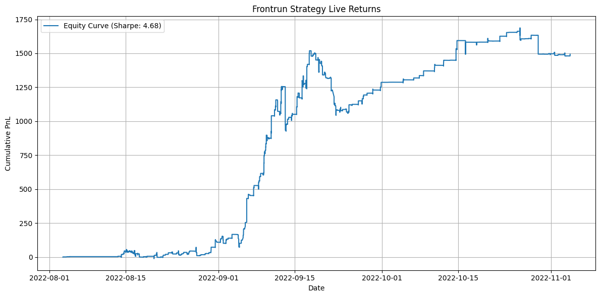

# Retail Frontrun Strategy

*A taker strategy that frontruns crypto‑signal channels on Telegram.*

## Overview

In 2022, Telegram crypto‑signal channels exploded in popularity. While most participants tried to mirror the posted trades, I discovered an edge in *being first*—entering the market a split‑second before the bulk of retail flow hit the order book and then exiting into their liquidity moments later.

This repository contains a lightweight Python bot that parses trade calls in real time and dispatches market orders to Binance via CCXT.

Retail order flow that follows signals is predictable. By automating a frontrun of these trades, the strategy captures the short‑lived price impact created when retail traders pile into the same side of the book.

Discontinued live trading this strategy in **November 2022** because the trade became crowded and the edge diminished.

## Live Performance

> *Equity (Aug – Nov 2022).*
